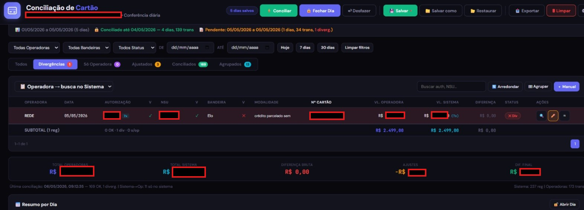
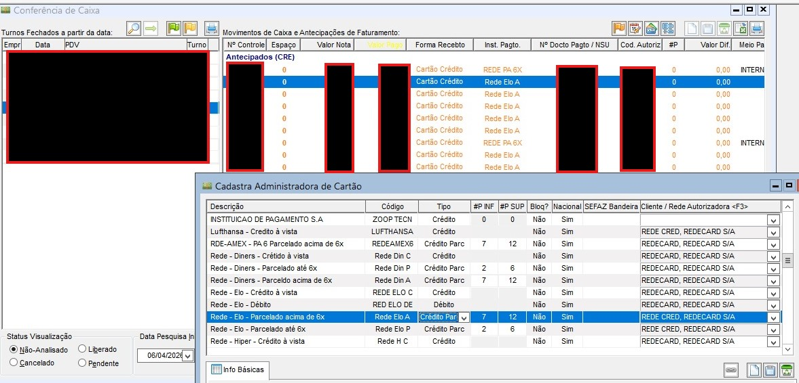
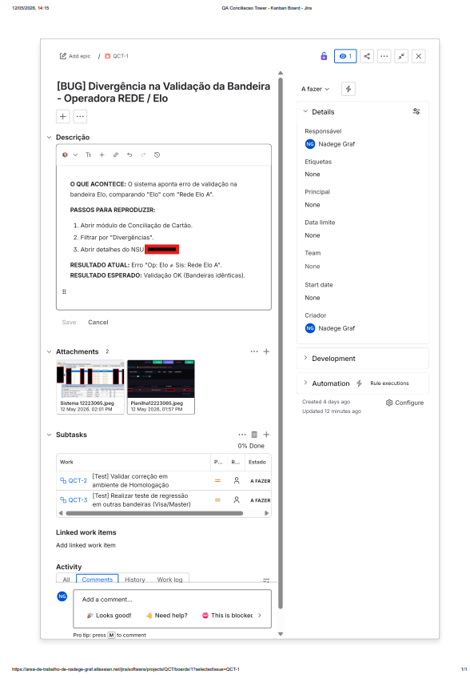
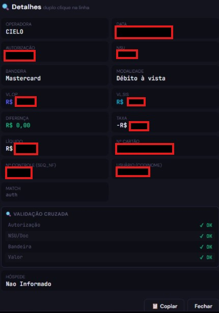
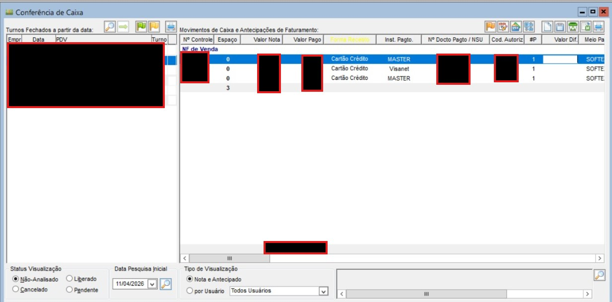
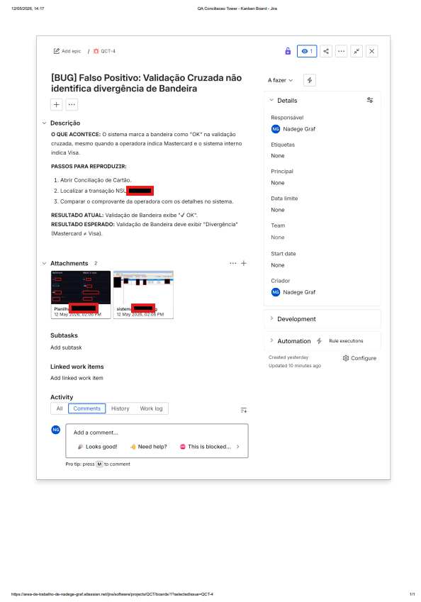
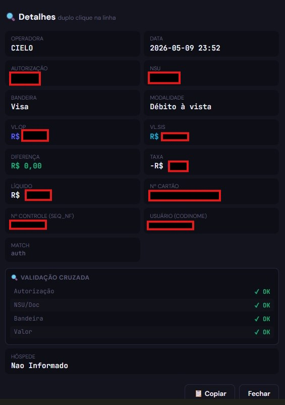
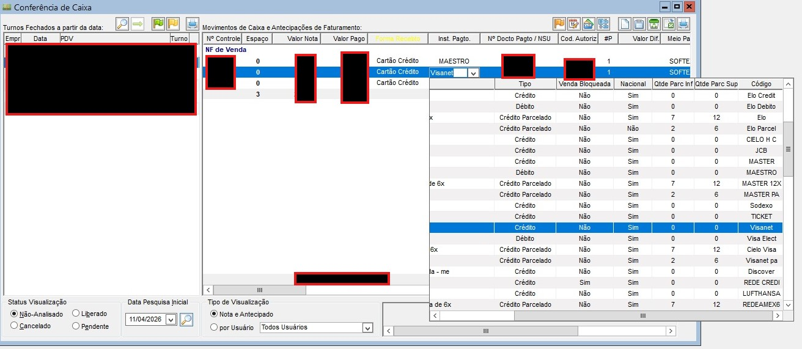
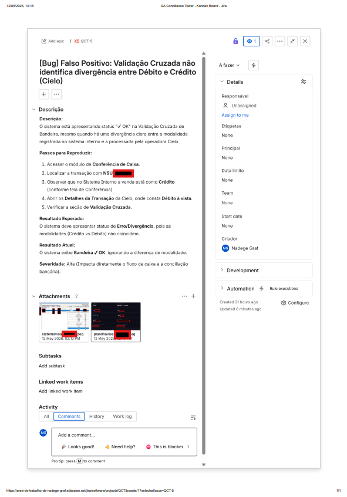

# Projeto QA: Sistema de Conciliação de Cartões (Operadoras REDE/CIELO)

Este projeto demonstra a estruturação completa de um fluxo de QA para conciliação financeira, com foco em integridade de dados e conformidade com LGPD.

## Ferramentas Utilizadas
* **Google Sheets**: Planejamento e Matriz de Casos de Teste. [[Acesse a Planilha aqui](https://docs.google.com/spreadsheets/d/1WFSED-WMCQUxCGm0hFPtHFzlPpJ0s69gC39vekAvE3k/edit?usp=sharing)]
* **Jira Service Management**: Gestão de incidentes e documentação técnica dos bugs.
* **GitHub**: Portfólio oficial e histórico de documentação.

---

## Detalhamento das Falhas Identificadas

### 1. Divergência de Nomenclatura - Bandeira Elo (QCT-1)
O sistema não reconhece a bandeira devido a máscaras de texto incompatíveis entre a operadora e o sistema interno.
**Evidências:**
  

### 2. Falso Positivo - Mastercard vs Visa (QCT-4)
Falha de lógica onde o sistema valida como "OK" transações com bandeiras divergentes.
**Evidências:**
  

### 3. Falso Positivo - Crédito vs Débito na Cielo (QCT-5)
Falha crítica onde o sistema não diferencia a modalidade de pagamento, aceitando dados divergentes como corretos.
**Evidências:**
  

---
*Nota: Todos os dados sensíveis foram protegidos (tarjas vermelhas/pretas) para garantir a segurança da informação conforme diretrizes de LGPD.*

